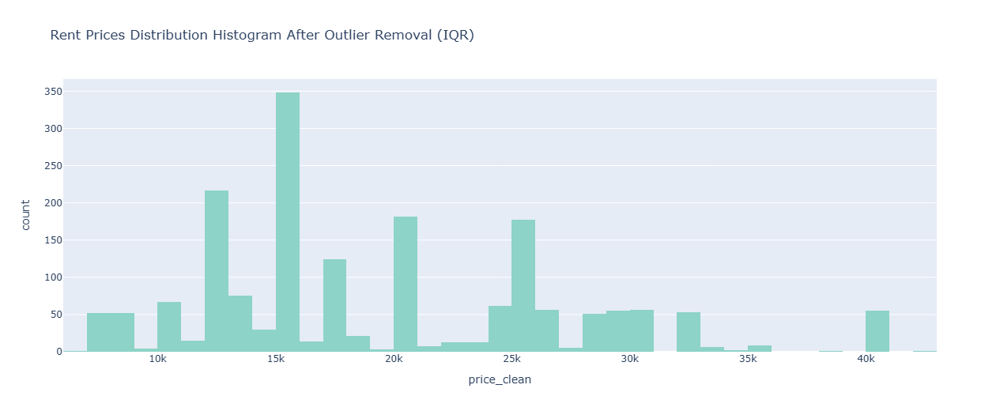

## 🏠 Rental House Price Prediction – Bursa, Turkey

### 📌 Project Description

This project focuses on predicting **rental apartment prices** in **Bursa, Turkey**, using real-world data collected from popular real estate websites. The aim is to build a **machine learning regression model** that can estimate rent prices based on features such as apartment size, floor level, number of rooms, location (district), building age, and heating type.

In today's rapidly shifting real estate market, both tenants and landlords benefit from tools that offer **data-driven price estimates**. This project provides such a solution, based on modern ML techniques and practical data collection.

---

### 🔍 Project Objectives

* To develop a **predictive model** that accurately estimates apartment rental prices.
* To **collect**, **clean**, and **analyze** real-world real estate data.
* To explore the **impact of property features** on rental prices using **EDA** and **feature importance analysis**.
* To compare and evaluate multiple regression models and find the most effective one.

---

### 📁 Dataset Overview

We built our **custom dataset** by scraping data from:

* [Remax](https://www.remax.com.tr/)
* [HepsiEmlak](https://www.hepsiemlak.com/)
* [Emlakjet](https://www.emlakjet.com/)

Key features collected:

* Price (TL)
* Net Area (m²)
* Floor Number
* Number of Bathrooms
* Number of Rooms
* District
* Building Age
* Heating Type
* Inside Site (Yes/No)
* Furnished (Yes/No)
* And many more...

---

### ⚙️ Machine Learning Problem Type

This is a **regression problem**, as we aim to predict a **continuous value** (rental price). We used several ML models to learn the relationship between property features and prices.

---

### 🧪 Experiments Conducted

#### 1. **Data Preprocessing**

* Missing value handling (mean imputation)
* Feature transformation and One-Hot Encoding
* Outlier filtering and type conversion

#### 2. **Exploratory Data Analysis (EDA)**

* Visual distribution of price, rooms, bathrooms, and floors
* Pairplots & heatmaps for correlation analysis
* Boxenplots to reveal how room count affects price
* Pie charts for categorical distributions
* Random Forest feature importance analysis

#### 3. **Model Training & Evaluation**

* Train/test split (70/30 and 80/20 variants)
* Scaled all features using `StandardScaler`
* Models used:

  * Linear Regression
  * Decision Tree Regressor
  * Support Vector Regressor (SVR)
  * Random Forest Regressor
  * Lasso Regression
* Evaluation metrics:

  * MAE, MSE, RMSE
  * R² Score

#### 4. **Single Prediction & New Data Prediction**

* Tested each model’s prediction on a real sample from test set
* Calculated prediction error %
* Showcased price prediction for a **new apartment** by simulating user input

---

### 📈 Key Results

* **Random Forest** delivered the best performance across all error metrics.
* Features such as **Net Area**, **Floor Level**, and **Total Number of Floors** were most impactful.
* Visualizations made relationships and trends in the data easy to interpret.

---

### 📷 Visual Results

Project outputs are supported with rich visualizations:

* Floor & bathroom distribution
* Room count vs. price plots
* Correlation heatmaps
* Actual vs. Predicted scatter plots
* Feature importance rankings
* MAE/MSE/RMSE comparison across models

---
## 📊 Random Forest Feature Importance

The chart below shows the feature importance scores from the Random Forest model.

**`m2_net_clean`** and **`bulundugu_kat_clean`** are the most influential features in predicting property prices.  
Features with low importance had minimal impact on model performance.

## 🎯 Actual vs Predicted Price

This scatter plot compares actual vs predicted prices from the model using multiple features.

- Each point represents a data sample.
- The red dashed line indicates **perfect prediction** (where predicted = actual).

The closer the points are to the red line, the better the model's performance.

## 📈 Feature Correlation Matrix

This heatmap shows the Pearson correlation coefficients between numerical features.

- Darker colors indicate weaker or negative correlations.
- Lighter areas (closer to white) show stronger positive correlations.
- `price_clean` is most strongly correlated with features like `m2_net_clean`, `oda_clean`, and `banyo_sayisi_clean`.

Understanding correlations helps to detect multicollinearity and feature redundancy.

### 1. Rent Prices Boxplot
- Shows the distribution of rent prices, including extreme outliers above 50,000 TL.

### 2. Rent Prices Histogram
- Most rent prices are between 10,000–30,000 TL. The long right tail shows a positive skew due to high-price listings.

### 3. Boxplot After Outlier Removal (IQR)
- After removing outliers, the rent price distribution appears more balanced and suitable for modeling.

### 4. Rent Prices Histogram After Outlier Removal (IQR)
- Outliers were removed using the IQR method. The distribution is now more focused and representative of typical rent values.

## Pairplot Between Numerical Features
- This pairplot helps to visually assess relationships between numerical features such as price, room count, and number of bathrooms. 
- It is useful for identifying correlations or patterns between variables.

## Boxenplot of Room Count vs Rent Price
- This boxenplot shows how rent price changes depending on the number of rooms.
- As the number of rooms increases, prices generally tend to rise, although there are visible outliers especially for higher room counts.

## Bathroom Count Distribution
- This barplot and pie chart illustrate the frequency distribution of bathrooms in rental listings.
- Most listings have 1 or 2 bathrooms, while a smaller portion includes 0, 3, or 4 bathrooms.
- This suggests that bathroom counts in rental properties are relatively standardized, with the majority concentrated in fewer categories.

